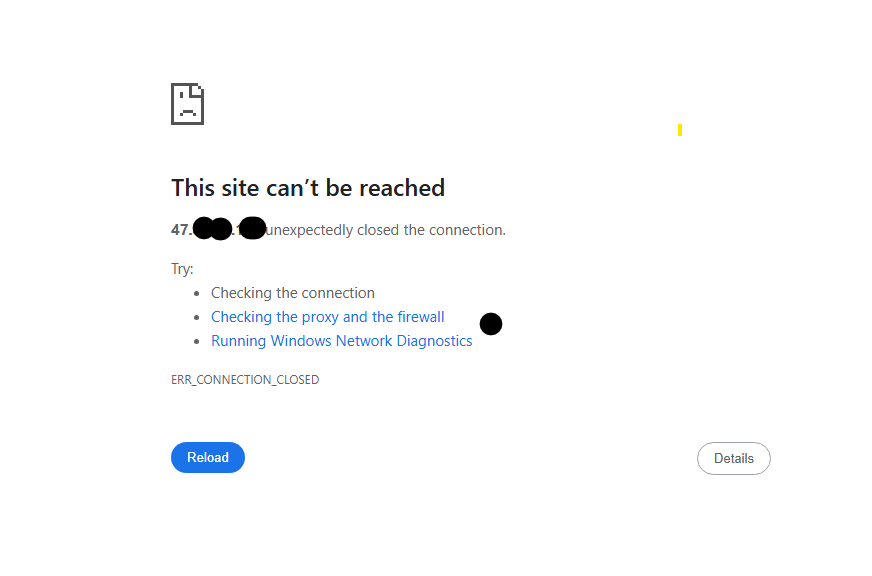
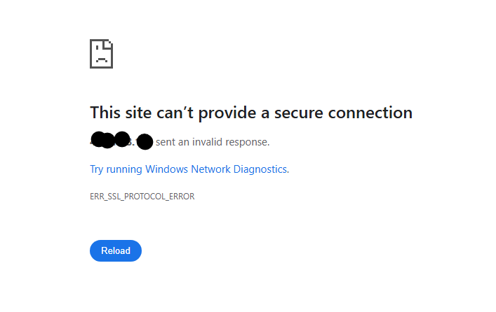
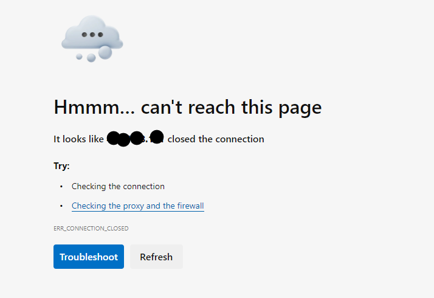
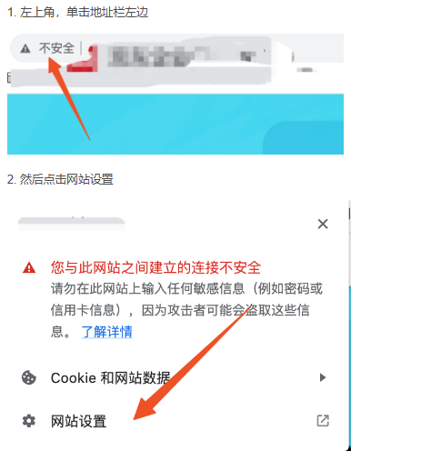
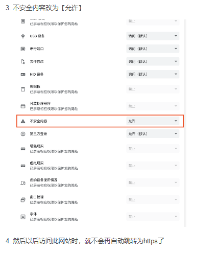

# 域名能進，IP直連不行？

今天碰到一件很吊詭的事情，網站可以通過域名訪問但是卻不能通過IP直連，見下圖：

上網搜了竟然神奇發現沒有任何類似的案例

## 原因：

**請檢查通過IP直連是否自動跳轉了https,  而沒有訪問http**

之前我在研究Nginx服務器訪問Port 80直接跳轉Port 443（即將所有的http跳轉到https），在google chrome上面嘗試過連接https，導致chrome嘗到甜頭之後瘋狂地自動連接https，即使我刪除掉網址欄中的s，再按回車，他也會重新導向https 現在kill了nginx，再部署docusaurus(ds)，由於我們沒有為ip設置SSL證書，此時就算部署到port443, 也會因爲證書問題而不能夠被訪問，同樣，即使用域名也是無法訪問的。 

 

可以看一下Cloudflare對於這個現象的[説明](https://community.cloudflare.com/t/community-tip-fixing-net-err-cert-authority-invalid/77958)

>  4. You are going directly to your IP  `https://123.123.123.123/`. What this means is that requests are going directly to your IP and won’t be going through Cloudflare. If you visit your domain `https://example.com/`  and you will see a valid certificate, it is because your domain is going through Cloudflare. Cloudflare Origin CA Certificate is only trusted by Cloudflare and therefore should only be used by origin servers that are actively connected to Cloudflare. If at any point you pause or disable Cloudflare, your Origin CA certificate will throw an untrusted certificate error.

那如果此時在port 80上監聽，則會造成開始説的問題：域名可以訪問，反而IP直連會連不上，這是因爲Cloudflare只對域名進行了認證，而ip地址是沒有認證的，所以https://[域名]可以訪問，而https://[IP]則不行，而又因爲之前嘗試過成功地通過nginx訪問https://[IP]，所以在你輸入ip時，他自動跳轉了，導致了問題。

 

## 解決方案：
取消google chrome的自動跳轉：

 
 